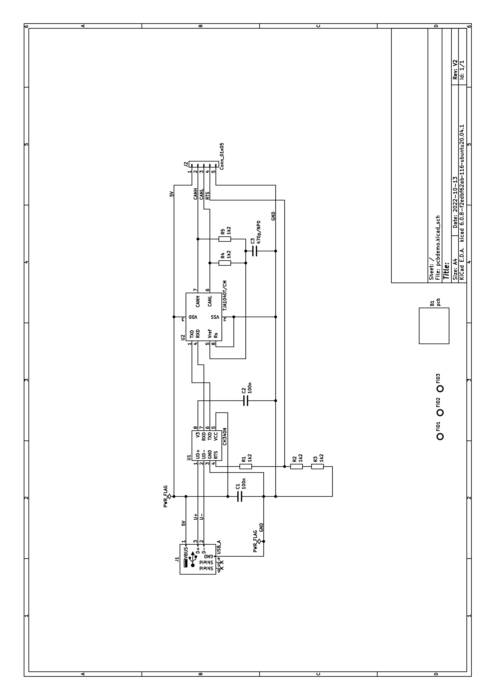
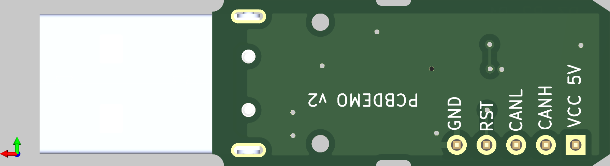

= Kicad project documentation

This document describes how I set up my Kicad projects to ease documentation and generation of PCB assembly files. Here I will use an example project, pcbdemo, a board which function you should not care about. It is just used as a base for documenting how I do things.

The scripts and make file prerequisites are ImageMagick, pdftk, asciidoc, asciidoctor and a2x. These tools should be available for most Linux distributions.

== Directories

=== Top directories

----
├── kicadlib   # My local libraries
├── mainboard  # Project directory
├── subcard    # Project directory
├── pcbdemo    # Project directory related to this document
├── scripts    # My scripts
----
I keep my projects under a common folder together with my local kicad libraries and scripts. These directories are all separate version controlled repositories, in my case git repositories.

=== Project directory

Each project directory holds both a documentation directory and the kicad design files directory. The project directory name is the same as the project name, reflected in file names and the base-variable of make files.For this 'pcbdemo' project the important files are:
----
├── doc   # Where the documentation is *
│   ├── html  # Generated html 
│       └── static  # Html static files
│   ├── Makefile  # To assemble the documentation *
│   ├── pcbdemo.adoc # The main documentation file, Asciidoc format *
│   |── static # Images and pdf-files for the asciidoc document
|   └── pcbdemo.pdf  # The pdf file generated by asciidoc
├── pcb  # Kicad files
│   ├── doc   # for manually generated images and pdf-files
│   ├── Makefile # To maintain bom and position files *
│   ├── pcbdemo_BOM.csv # Vendor and product number file *
│   ├── pcbdemo.kicad_pcb # The Pcbnew board file *
│   ├── pcbdemo.kicad_pro # The Kicad project file *
│   ├── pcbdemo.kicad_sch # The schematic file *
│   ├── pcbdemo_ROT.csv   # Component rotations *
│   ├── gerb  # Produced gerber and drill files
│   └── prod # generated BOM and postion files

----
Files marked by an asterix are files maintained in the version control repository. The doc directory is for the documentation. The asciidoc file is the main file. The doc make target copies relevant files from ../pcb directories to the static directory and converts pdf schematic files to png images. The pdf make target produces the pcbdemo.pdf file. The make target html produces pcbdemo.html in the html directory and copies images and pdf files to html/static.

The directories and files *not* marked by an asterix contain only produced files and may be deleted at any time.

== The pcb directory
This directory holds the Kicad and derived files. A makefile produces the BOM and position files. Manually generated files are a pdf-plot of the schematics (doc/pcbdemo.pdf) and gerber and drill files in the gerb directory. The zip makefile target zips the gerb files into the prod directory. The prod directory thus holds the files used for PCB production and assembly. 

Also manually generated files are the doc/pcbdemo_brd_top.png and possibly doc/pcbdemo_brd_bottom.png files exported from the 3D viewer.

=== Modification files

The genproddoc.py script reads component properties from the kicad_pcb file and produces the bom files. These component values are then updated with component value, vendor name and vendor SKU from the pcbdemo_BOM.csv file. For each run of the script this file is updated, using the modified values, to change if board components have been deleted or added. I find this method easier than adding and editing vendor and SKU number fields to each and every component of the schematics.

The zero rotation angle of components are defined by IPC, but Kicad libraries and assembly houses may deviate from this. The rotation can be changed to fit the assempler's definition by using the pcbdemo_ROT.csv file. There, the rotation angle expected by the assembler is defined for each component. When generating the position file for use by the pick and place machoine of the assembler, the angles from this file is used, neglecting whatever angles are given in the kicad_pcb file.    

==== BOM files

The genproddoc.py script generates three BOM-files: top components (pcbdemo_bom_T.csv), bottom components (pcbdemo_bom_B) and all components grouped together (pcbdemo_bom_G.csv). Components are grouped based on footprint and value. Components where the exclude from BOM property is set will be excluded. 

The script will extract component properties from the kicad_pcb file and modify values, vendor and SKU by the values read from the pcbdemo_BOM.csv file. Then the script writes this back to the pcbdemo_BOM.csv file. Thus the BOM file will be updated according to components added or deleted from the board. 

The point of the pcbdemo_BOM.csv file is to let the user maintain component details related to purchases in this csv file instead of by component fields in the schematics. These properties will be reflected in the generated csv files.

The procedure the is to first run make to generate the csv files, edit the pcbdemo_BOM.csv file for the next production and then run make again.

==== Position file
The script also generates a position file contains component placement coordinates and rotation angles, used by the assembly house to program the pick and place machine. The rotation angles are as given in the pcbdemo_ROT.csv file. 

The coordinates are relative to the origin set for the _component placement  and drill files_ in Pcbnew. To match the coordinates of the gerber files to the position files you must also tick the _Use drill/place file origin_ option of the gerber plot screen.
 
This has been tested at the jlcpcb.com site. First upload the BOM and CPL (compnent placement list) files and chack how the component rotation ends up in their version of the rendered board. Then change the angle of any wrongly rotated component in the pcbdemo_ROT.csv file, run make and upload the file again.

== The doc directory
The documentation is edited in the pcbdemo.adoc file, from this file both a pdf and html version can be generated.

A make-file in this directory runs a script that copies PNG and PDF files from the pcb/doc directory and csv-files from the pcb/prod directory. The schematic file is split into induvidual files and these are then converted into PNG-images.

The script then generates a PDF version (pcbdemo.pdf) version of the document as well as a html version html/pcdemo.html with the sub directory holding files referanced from the html page. As all the files in the html directory are named after the project name html and static files for several projects can share the same directories on a web server.

== Examle documentation
The text above describes how I document my Kicad projects. For regular documentation this file will rather describe the circuit and discuss strategy and component values. I use Asciidoc, but this is not an Asciidoc tutorial.

To support the description the schematics will be included. The schematics can possibly be covered over several sheets. But in this case only one:

Usually also the BOM is included. For this project the board outline (B1), a through hole connector (J2) and the three fiducials (FID1-3) where set in the schematic editor to be excluded from bill of metarials.

[small]
[format="dsv",cols="6*1"]
|===================================================

include::static/pcbdemo_bom_G.csv[]
|===================================================

In the schemitics editor the component edit dialogue allows for ticking of the Exclude from bill of materials option. This is mainly for used for "Do not mount" components, board outlines and possibly fiducials. Some assembly houses may want the fiducial coordinates for their pick and place machine though.

And also the images of the PCB top and bottom will usually be included in this document:

image::static/pcbdemo_brd_top.png["PCB top side"]

The makefile will crop the images to the PCB outline. To allow for this to happen, goto the 3D veiewer preferences and set the color gradient start and stop color to the same RGB value, here I used (200,200,200). The crop will not pass the 3D axis symbol, so place the PCB image close to this symbol.

== File name convensions

The scripts and make files assume some standard file naming convensions.

All files starts with the project name (defined by the makefile BASE variable). 
The manually generated files are BASE.pdf for the schematics and BASE_brd_top.png and BASE_brd_bottom.png for the PCB images. 

The Kicad files resides under pcb and the asciidoc files under doc. The production and documentation files will be generated by runnig the make files from their respective directory. By these naming convensions and directory structure the only adaption for a new project is to coopy the makefiles scripts/Makefile_doc and scripts/Makefile_pcb to Makefile in their respective directories doc and pcb and change the BASE variable of the make files. 

The gerber and drill files must be written to the pcb/gerb folder.

Some files should be maintained under a source code repository, e. g. git. However some of the generated files may depend on software versions and Kicad options. For tracability the gerber, drill and csv files should also be kept in the repository. When the files have been zipped up for production the files can be checked in and tagged according to the board revision. In this way the "as produced" files can later be easily retrieved.    

